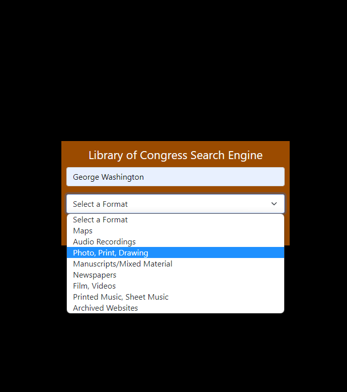
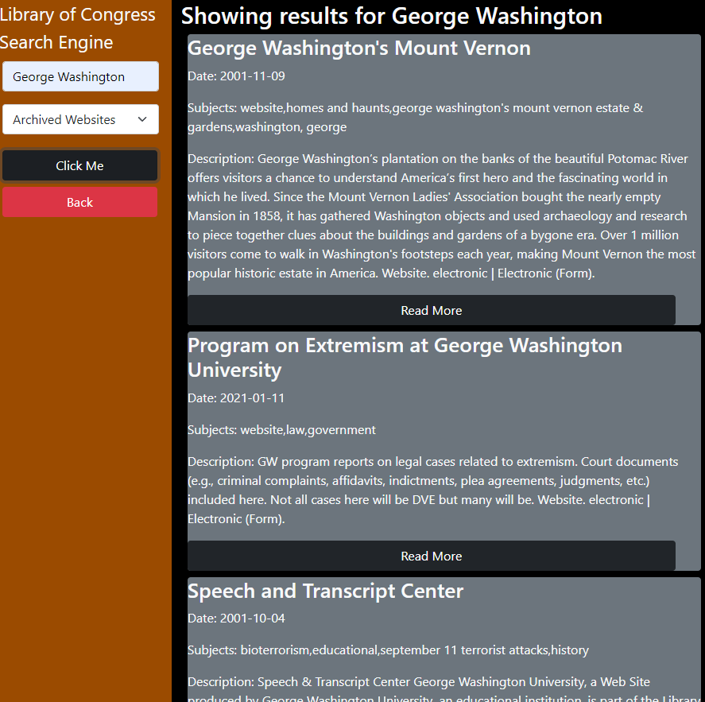

# **Library of Congress Search Tool**

This web app searches and displays results from the Library of Congress API. If you would like to use the web app visit our site [here](https://coderbennett.github.io/loc-search-tool/).

## **How to Use**

---

Our search tool uses the Library of Congress API to provide a user with information they request.

When you visit our page you can select from a list of formats to search for, as well as an input for to type in any subject you are interested in reading about.

---

Once you click the button below these options, it will provide you with the search results.

As seen in the above image, you will be provided with all the results, including a title of the item, a date for when it was created, a description of the result and there is also a read more button at the bottom.

## **Authors**

---

Hello there, we are a group of web developers creating projects with a variety of APIs, in this case we were using the Library of Congress API.

If you are interested in getting to know any of us, you can find out GitHub profiles below:

* [coderbennett's GitHub](https://github.com/coderbennett)
* [cmwschroeder's GitHub](https://github.com/cmwschroeder)
* [kyliemshinn's GitHub](https://github.com/kyliemshinn)
* [KrystopherQ's GitHub](https://github.com/KrystopherQ)